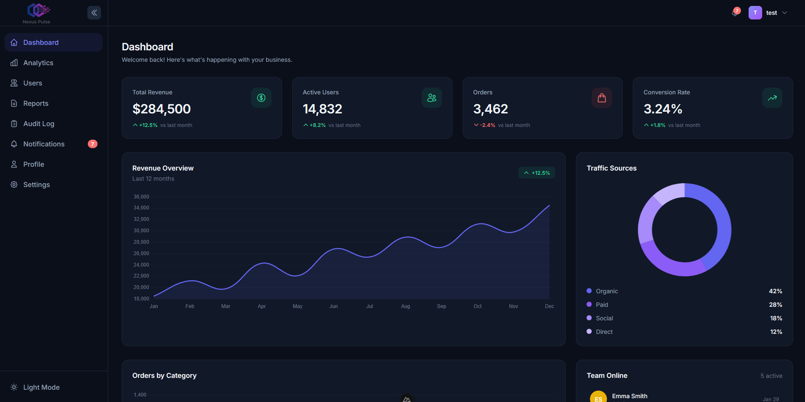

# Nexus Pulse Dashboard

A modern, feature-rich analytics dashboard built with Nuxt 3, TypeScript, and Tailwind CSS. This project demonstrates advanced frontend development skills including state management, data visualization, responsive design, and comprehensive testing.



## 🚀 Features

### Core Pages

- **Dashboard** - Overview with stat cards, revenue charts, traffic sources, and activity feed
- **Analytics** - Detailed analytics with date range filters, category breakdowns, and interactive charts
- **Users** - User management with sortable/filterable data table, pagination, and CRUD operations
- **Reports** - Report generation and management with status tracking and filtering
- **Audit Log** - Comprehensive audit trail with expandable rows and advanced filtering
- **Notifications** - Real-time notification system with read/unread states and filtering
- **Profile** - User profile management with avatar, personal info, and preferences
- **Settings** - Application settings with theme toggle and notification preferences

### Advanced Features

- **Collapsible Sidebar** - Smooth animations with localStorage persistence
- **Skeleton Loading States** - Professional loading indicators for all data-driven components
- **Toast Notifications** - Animated toast system for user feedback
- **Activity Feed** - Real-time activity tracking with user presence indicators
- **Empty States** - Beautiful empty state designs for all list views
- **Data Filters** - Advanced filtering with date ranges, categories, and search
- **User Presence** - Online user indicators and activity tracking
- **Mobile Experience** - Fully responsive design with bottom navigation and touch gestures

### Technical Highlights

- **TypeScript** - Full type safety across the entire codebase
- **Pinia Stores** - Centralized state management with 8 stores
- **Chart.js Integration** - Interactive charts with custom tooltips and animations
- **Cookie-based Auth** - Secure authentication with JWT tokens
- **Route Guards** - Protected routes with middleware
- **Composables** - Reusable logic with Vue 3 composables
- **Component Library** - 15+ reusable UI components
- **Dark Mode** - Theme switching with CSS variables
- **Responsive Design** - Mobile-first approach with breakpoint-specific layouts
- **Testing** - 79 unit tests with Vitest (100% passing)

## 🛠️ Tech Stack

- **Framework**: [Nuxt 3](https://nuxt.com/)
- **Language**: [TypeScript](https://www.typescriptlang.org/)
- **State Management**: [Pinia](https://pinia.vuejs.org/)
- **Styling**: [Tailwind CSS](https://tailwindcss.com/)
- **Charts**: [Chart.js](https://www.chartjs.org/) + [vue-chartjs](https://vue-chartjs.org/)
- **Testing**: [Vitest](https://vitest.dev/) + [Vue Test Utils](https://test-utils.vuejs.org/)
- **Icons**: Inline SVG (no external dependencies)

## 📦 Installation

```bash
# Clone the repository
git clone <your-repo-url>

cd nexus-pulse-dashboard

# Install dependencies
npm install

# Start development server
npm run dev
Open http://localhost:3000 in your browser.

📝 Available Scripts
bash


# Development
npm run dev          # Start development server with hot reload

npm run build        # Build for production

npm run preview      # Preview production build

# Testing
npm run test         # Run all tests

npm run test:watch   # Run tests in watch mode

npm run test:coverage # Generate coverage report

# Linting
npm run lint         # Run ESLint

npm run lint:fix     # Fix ESLint errors
🧪 Testing
The project includes comprehensive test coverage with 79 tests across 13 test files:

Test Coverage
Store Tests (42 tests)

Auth store: Login, logout, token management
Users store: CRUD operations, filtering, sorting, pagination
Notifications store: Read/unread states, filtering, deletion
Reports store: Status/type filtering, search, retry
Audit log store: Date range, user/action filters, search
Component Tests (23 tests)

Badge, Button, Toggle, Modal, StatCard
DataTable with sorting, filtering, pagination
Empty states and loading states
Composable Tests (6 tests)

useTheme: Theme toggling, localStorage, document class
usePagination: Page calculations, boundaries
Utility Tests (8 tests)

Formatters: Currency, dates, percentages, numbers
Run tests with:

bash


npm run test
📁 Project Structure
text


nexus-pulse-dashboard/

├── assets/

│   └── css/

│       └── main.css              # Global styles and CSS variables

├── components/

│   ├── charts/                   # Chart components (Line, Bar, Doughnut, Area)

│   ├── dashboard/                # Dashboard-specific components

│   ├── layout/                   # Layout components (Sidebar, Header, Footer, BottomNav)

│   ├── tables/                   # Table components (DataTable, Pagination)

│   └── ui/                       # Reusable UI components (Badge, Button, Input, Modal, etc.)

├── composables/                  # Vue 3 composables (useAuth, useTheme, usePagination)

├── layouts/                      # Nuxt layouts (default, auth)

├── middleware/                   # Route middleware (auth guard)

├── pages/                        # Application pages

│   ├── index.vue                 # Dashboard

│   ├── analytics.vue             # Analytics

│   ├── users.vue                 # Users management

│   ├── reports.vue               # Reports

│   ├── auditLog.vue              # Audit log

│   ├── notifications.vue         # Notifications

│   ├── profile.vue               # User profile

│   ├── settings.vue              # Settings

│   ├── login.vue                 # Login page

│   └── [...catchAll].vue         # 404 page

├── stores/                       # Pinia stores

│   ├── auth.ts                   # Authentication state

│   ├── dashboard.ts              # Dashboard data

│   ├── analytics.ts              # Analytics data

│   ├── users.ts                  # Users management

│   ├── reports.ts                # Reports management

│   ├── auditLog.ts               # Audit log data

│   ├── notifications.ts          # Notifications state

│   ├── profile.ts                # User profile

│   └── settings.ts               # App settings

├── tests/                        # Vitest test files

│   ├── components/               # Component tests

│   ├── stores/                   # Store tests

│   ├── composables/              # Composable tests

│   └── utils/                    # Utility tests

├── types/                        # TypeScript type definitions

├── utils/                        # Utility functions (formatters, mock data)

└── nuxt.config.ts                # Nuxt configuration
🎨 Design System
Colors
The dashboard uses CSS custom properties for theming, making it easy to customize:

css


--color-bg-primary       # Primary background

--color-text-primary     # Primary text color

--color-accent           # Accent/brand color

--color-success          # Success states

--color-warning          # Warning states

--color-danger           # Error/danger states
Typography
Font Family: Inter (Google Fonts)
Font Sizes: Responsive scale from xs to 9xl
Font Weights: 300, 400, 500, 600, 700, 800
Spacing
Consistent spacing scale using Tailwind's default spacing system.

Shadows
Custom shadow utilities for depth and elevation:

shadow-soft - Subtle shadows for cards
shadow-card - Standard card shadows
shadow-elevated - Elevated elements (modals, dropdowns)
🔐 Authentication
The dashboard uses cookie-based JWT authentication:

Login: Any email with password password123
Token Storage: HTTP-only cookies for security
Route Guards: Middleware protects authenticated routes
Auto-redirect: Unauthenticated users redirected to login
📱 Responsive Design
The dashboard is fully responsive with three breakpoints:

Mobile (< 768px): Bottom navigation, stacked layouts, card views
Tablet (768px - 1024px): Adaptive layouts, collapsible sidebar
Desktop (> 1024px): Full sidebar, multi-column layouts
Mobile Features
Bottom navigation bar with 5 main sections
Swipe-to-close gesture on sidebar
Card-based table views for better mobile UX
Safe area support for notched devices
Touch-optimized interactions
🚀 Deployment
Vercel (Recommended)
bash


npm run build
# Deploy the .output directory to Vercel
Netlify
bash


npm run build
# Deploy the .output/public directory to Netlify
Docker
dockerfile


FROM node:18-alpine

WORKDIR /app

COPY package*.json ./

RUN npm ci

COPY . .

RUN npm run build

EXPOSE 3000

CMD ["node", ".output/server/index.mjs"]
🤝 Contributing
This is a portfolio project, but suggestions and feedback are welcome!

📄 License
MIT License - feel free to use this project for learning or as a starting point for your own dashboard.

🙏 Acknowledgments
Design inspiration from modern SaaS dashboards
Chart.js for powerful data visualization
Nuxt 3 team for the amazing framework
Tailwind CSS for the utility-first approach
📧 Contact
For questions or feedback, please open an issue on GitHub.

Built with ❤️ using Nuxt 3, TypeScript, and Tailwind CSS
```
